# 🏥 Explainable Multimodal Clinical AI Assistant

**CNN + MedGemma Fusion for Chest X-ray Analysis with Grad-CAM Explainability**

[](https://python.org)
[](https://pytorch.org)
[](https://fastapi.tiangolo.com)
[](https://streamlit.io)
[](https://developer.apple.com/metal/)
[](LICENSE)
[](https://colab.research.google.com/github/chiraniadhruv7/Med-Ai/blob/main/Med_Ai.ipynb)

<br>

> ⚠️ **For research and educational purposes only. Not clinically validated or intended for diagnostic use.**

<br>


</div>

---

## 📖 Overview

A production-quality, **modular medical AI system** that fuses **DenseNet121 CNN** pathology detection with **MedGemma 4B** multimodal LLM reasoning to analyze chest X-rays. The system provides:

- 🔬 **14-class pathology detection** from chest X-rays using DenseNet121
- 🧠 **Multimodal clinical reasoning** via MedGemma (local MLX inference — fully private)
- 🔥 **Grad-CAM visual explainability** showing where the AI looks
- 📊 **Confidence-calibrated fusion** merging CNN + LLM outputs with contradiction detection
- ⚡ **Apple Silicon optimized** — MPS acceleration, no CUDA required
- 🎨 **Premium Streamlit UI** with dark medical theme

---

## 🏗️ System Architecture

```mermaid
flowchart TB
    subgraph Input["📥 Input"]
        IMG[🩻 Chest X-ray]
        SYM[📝 Symptom Text]
    end

    subgraph Pipeline["⚙️ Analysis Pipeline"]
        CNN["🔬 DenseNet121 CNN<br><i>14 pathology probabilities</i>"]
        LLM["🧠 MedGemma 4B<br><i>Clinical reasoning + differentials</i>"]
        FUS["🔀 Fusion Module<br><i>Agreement boost + contradiction detection</i>"]
        UNC["📊 Uncertainty Estimation<br><i>Entropy-based confidence calibration</i>"]
        RSK["⚠️ Risk Stratification<br><i>Rule-based: Low / Moderate / High</i>"]
        CAM["🔥 Grad-CAM<br><i>Visual attention heatmap</i>"]
    end

    subgraph Output["📤 Output"]
        JSON["📋 Structured JSON"]
        UI["🖥️ Streamlit Dashboard"]
    end

    IMG --> CNN
    IMG --> LLM
    SYM --> LLM
    CNN --> FUS
    LLM --> FUS
    FUS --> UNC
    UNC --> RSK
    CNN --> CAM
    RSK --> JSON
    CAM --> JSON
    JSON --> UI

    style Input fill:#1e3a5f,stroke:#38bdf8,color:#e2e8f0
    style Pipeline fill:#0f172a,stroke:#475569,color:#e2e8f0
    style Output fill:#064e3b,stroke:#34d399,color:#e2e8f0
```



### Pipeline Modules

| Step | Module | Description | Output |
|:----:|--------|-------------|--------|
| 1 | `cnn_model.py` | DenseNet121 pretrained on ImageNet, modified for 14 CXR pathologies | `dict[str, float]` — probability per pathology |
| 2 | `multimodal_reasoning.py` | MedGemma 4B via MLX (local) or Gemini API (fallback) | Clinical reasoning, differential diagnosis |
| 3 | `fusion.py` | Merges CNN + LLM results, detects model contradictions | Adjusted findings with agreement/conflict flags |
| 4 | `uncertainty.py` | Entropy-based CNN confidence + LLM token confidence | Per-source and fused confidence scores |
| 5 | `risk_module.py` | Rule-based stratification (thresholds on pathology probs) | `Low` / `Moderate` / `High` |
| 6 | `explainability.py` | Grad-CAM on DenseNet121 final conv layer | Base64-encoded heatmap overlay |

---

## ⚡ Quick Start

### Prerequisites

| Requirement | Version | Notes |
|-------------|---------|-------|
| macOS | 13+ (Ventura) | Apple Silicon (M1/M2/M3/M4) recommended |
| Python | 3.11+ | 3.11 recommended; 3.13 compatible |
| Xcode CLT | Latest | `xcode-select --install` |
| Disk Space | ~12 GB | For MedGemma model weights |
| RAM | 16 GB+ | 8 GB minimum (model uses ~5 GB) |

### Installation

```bash
# 1. Clone the repository
git clone https://github.com/yourusername/Med-Ai.git
cd Med-Ai

# 2. Create and activate virtual environment
python3 -m venv venv
source venv/bin/activate

# 3. Install dependencies
pip install --upgrade pip
pip install -r requirements.txt

# 4. Configure environment
cp .env.example .env
# Edit .env if needed (defaults work for local inference)

# 5. Download MedGemma model (~10.2 GB, one-time download)
python -c "
from huggingface_hub import snapshot_download
snapshot_download('mlx-community/medgemma-4b-it-8bit')
print('Download complete!')
"

# 6. Verify setup
python -c "import torch; print(f'PyTorch: {torch.__version__}, MPS: {torch.backends.mps.is_available()}')"
```

> **💡 Tip:** The MedGemma download requires a Hugging Face account. Run `huggingface-cli login` first if prompted.

### Running the Application

You need **two terminal windows** — one for the backend and one for the frontend:

```bash
# Terminal 1: Start FastAPI backend
source venv/bin/activate
uvicorn main:app --host 127.0.0.1 --port 8000
```

Wait for `[MedGemma] Local model loaded successfully.` then:

```bash
# Terminal 2: Start Streamlit frontend
source venv/bin/activate
streamlit run app.py
```

Open **http://localhost:8501** in your browser.

---

## 📓 Try It in Google Colab

Don't have an Apple Silicon Mac or prefer a cloud-based setup? You can run the entire analysis pipeline directly in **Google Colab** — no local installation required.

[](https://colab.research.google.com/github/chiraniadhruv7/Med-Ai/blob/main/Med_Ai.ipynb)

### Colab Prerequisites

| Requirement | Details |
|-------------|---------|
| **Google Account** | Required to access Google Colab |
| **GPU Runtime** | Select **Runtime → Change runtime type → T4 GPU** (free tier works) |
| **Hugging Face Token** | Required to download MedGemma weights — [get one here](https://huggingface.co/settings/tokens) |
| **MedGemma License** | Accept the model license at [google/medgemma-4b-it](https://huggingface.co/google/medgemma-4b-it) before running |
| **Kaggle API Key** | Required to download the NIH Chest X-ray dataset — [create one here](https://www.kaggle.com/settings) |
| **NIH Labels CSV** | Upload `Data_Entry_2017.csv` when prompted (from the [NIH Chest X-ray dataset](https://www.kaggle.com/datasets/nih-chest-xrays/data)) |

### What the Notebook Covers

- 🚀 **One-click setup** — installs all dependencies (PyTorch, Transformers, etc.) inside the Colab runtime
- 📦 **Dataset download** — pulls real chest X-ray images from Kaggle via API
- 🔬 **CNN fine-tuning** — trains DenseNet121 on 14 CXR pathologies with mixed-precision training
- 📊 **Full evaluation** — AUC-ROC curves, confusion matrices, and optimal threshold selection
- 🔥 **Grad-CAM visualization** — see heatmap overlays highlighting model attention regions
- 🧠 **MedGemma reasoning** — multimodal clinical reasoning powered by MedGemma 4B
- 🔀 **Fusion & risk assessment** — CNN + LLM fusion with contradiction detection and risk stratification

> **💡 Tip:** The free T4 GPU runtime is sufficient. Training takes ~2 min/epoch and full inference runs in seconds.

---

## 🖥️ Usage

### Through the Web UI

1. **Upload** a chest X-ray image (PNG, JPG, JPEG)
2. **Enter** patient symptoms (e.g., *"persistent cough for 5 days, fever 101°F, shortness of breath"*)
3. Click **🔬 Analyze**
4. View results:
   - **Risk Badge** — Color-coded severity (🟢 Low / 🟡 Moderate / 🔴 High)
   - **Confidence Bars** — CNN, LLM, and Fused confidence scores
   - **Visual Findings** — 14 pathology probabilities with progress bars
   - **Clinical Reasoning** — MedGemma's natural language analysis
   - **Differential Diagnosis** — Ranked list of possible conditions
   - **Model Contradictions** — Where CNN and LLM disagree
   - **Grad-CAM Heatmap** — Toggle to see where the AI focused

### Through the API

```bash
# Health check
curl http://127.0.0.1:8000/health

# Analyze an X-ray
curl -X POST http://127.0.0.1:8000/analyze \
  -F "image=@path/to/xray.png" \
  -F "symptoms=persistent cough and fever"
```

### API Response Format

```json
{
  "visual_findings": {
    "Pneumonia": 0.77,
    "Effusion": 0.78,
    "Atelectasis": 0.48,
    "Cardiomegaly": 0.29,
    "...": "..."
  },
  "clinical_reasoning": "Based on the radiographic findings and reported symptoms...",
  "differential_diagnosis": ["Pneumonia", "Bronchitis", "Viral URI"],
  "confidence_scores": {
    "cnn": 0.03,
    "llm": 0.70,
    "fused": 0.31
  },
  "risk_level": "Moderate",
  "risk_factors": ["High probability: Effusion (0.79)", "High probability: Pneumonia (0.77)"],
  "contradictions": [
    {
      "pathology": "Atelectasis",
      "cnn_probability": 0.48,
      "note": "CNN detected but LLM did not mention"
    }
  ],
  "heatmap_available": true,
  "heatmap_base64": "<base64-encoded PNG>"
}
```

---

## 📁 Project Structure

```
med-ai2/
├── main.py                         # FastAPI server — orchestrates the full pipeline
├── app.py                          # Streamlit UI — premium dark medical theme
│
├── modules/
│   ├── __init__.py
│   ├── cnn_model.py                # DenseNet121 — 14-class CXR pathology detection
│   ├── multimodal_reasoning.py     # MedGemma — local MLX / API / dummy inference
│   ├── fusion.py                   # CNN + LLM fusion with contradiction detection
│   ├── risk_module.py              # Rule-based risk stratification
│   ├── uncertainty.py              # Entropy-based confidence estimation
│   └── explainability.py           # Grad-CAM heatmap generation
│
├── evaluation/
│   ├── __init__.py
│   └── metrics.py                  # AUC-ROC, confusion matrix utilities
│
├── tests/
│   └── test_pipeline.py            # End-to-end pipeline tests (6 tests)
│
├── assets/
│   ├── sample_xray.png             # Sample test image
│   ├── ui_screenshot.png           # UI screenshot
│   └── demo_screenshot.png         # Demo with results
│
├── Med_Ai.ipynb                    # 📓 Colab notebook — run the full pipeline in the cloud
├── requirements.txt                # Apple Silicon compatible dependencies
├── .env.example                    # Environment variable template
├── .env                            # Local environment config (git-ignored)
└── README.md
```

---

## 🧠 Technical Deep Dive

### MedGemma Inference

The system uses **MedGemma 4B IT** (`mlx-community/medgemma-4b-it-8bit`) quantized to 8-bit for efficient Apple Silicon inference via the [MLX](https://github.com/ml-explore/mlx) framework.

| Property | Value |
|----------|-------|
| Model | `mlx-community/medgemma-4b-it-8bit` |
| Parameters | 4 billion (8-bit quantized) |
| Size on disk | ~10.2 GB |
| Framework | MLX + mlx-vlm |
| Inference device | Apple Silicon (Metal) |
| Fallback | Google Gemini API → Dummy mode |

**Inference modes** (configured via `MEDGEMMA_MODE` in `.env`):

| Mode | How it works |
|------|-------------|
| `local` | Loads model weights from HuggingFace cache, runs on Apple Silicon via MLX |
| `api` | Sends requests to Google Gemini API (requires `GEMINI_API_KEY`) |
| `dummy` | Returns templated responses (no model required — for testing) |

### CNN Pathology Detection

**DenseNet121** pretrained on ImageNet with a modified classifier head for 14 standard CXR pathologies:

```
Atelectasis · Cardiomegaly · Effusion · Infiltration · Mass · Nodule
Pneumonia · Pneumothorax · Consolidation · Edema · Emphysema
Fibrosis · Pleural Thickening · Hernia
```

> **Note:** The model uses ImageNet pretrained weights, not CheXpert/MIMIC-trained weights. Probabilities reflect learned visual features but are not clinically calibrated.

### Fusion & Contradiction Detection

The fusion module performs intelligent merging:

1. **Agreement boost** — When both CNN and LLM identify the same condition, confidence increases
2. **Contradiction detection** — When CNN flags a pathology that LLM doesn't mention (or vice versa), the system flags it and reduces confidence
3. **Weighted combination** — CNN (visual) and LLM (clinical reasoning) scores are blended based on per-source confidence

### Grad-CAM Explainability

Gradient-weighted Class Activation Mapping on DenseNet121's final convolutional layer:

- Registers forward/backward hooks to capture activations and gradients
- Computes channel-wise gradient weights
- Generates a heatmap overlay on the original X-ray
- Returns as base64-encoded PNG for frontend display

**Technical fix applied:** DenseNet121 uses `inplace=True` ReLU operations that conflict with PyTorch's autograd backward hooks. The implementation deep-copies the model and patches all ReLU operations to `inplace=False` before computing Grad-CAM.

---

## 🧪 Testing

```bash
# Run all pipeline tests
python tests/test_pipeline.py

# Expected output:
# ============================================================
#   Explainable Clinical AI — Pipeline Tests
# ============================================================
# [TEST] CNN prediction...        ✓ 14 pathologies predicted
# [TEST] MedGemma dummy mode...   ✓ Reasoning generated
# [TEST] Fusion module...         ✓ Fused findings computed
# [TEST] Uncertainty estimation... ✓ Confidence scores calibrated
# [TEST] Risk stratification...   ✓ High/Low risk correctly assigned
# [TEST] Grad-CAM explainability. ✓ Heatmap generated
# ============================================================
#   ✅ ALL TESTS PASSED
# ============================================================
```

### API Testing

```bash
# Start the backend first, then:

# Health check
curl http://127.0.0.1:8000/health
# → {"status": "healthy", "cnn_ready": true}

# Full analysis
curl -X POST http://127.0.0.1:8000/analyze \
  -F "image=@assets/sample_xray.png" \
  -F "symptoms=persistent cough and fever"
```

---

## ⚙️ Configuration

### Environment Variables (`.env`)

| Variable | Default | Description |
|----------|---------|-------------|
| `MEDGEMMA_MODE` | `local` | Inference mode: `local`, `api`, or `dummy` |
| `GEMINI_API_KEY` | *(empty)* | Required only if `MEDGEMMA_MODE=api` |
| `BACKEND_HOST` | `127.0.0.1` | FastAPI server host |
| `BACKEND_PORT` | `8000` | FastAPI server port |

### Apple Silicon (MPS) Notes

- PyTorch **automatically uses MPS** (Metal Performance Shaders) on Apple Silicon
- Falls back to CPU if MPS is unavailable
- No CUDA or NVIDIA GPU required
- MedGemma runs via MLX, which is native to Apple Silicon

---

## 🔧 Troubleshooting

| Issue | Solution |
|-------|----------|
| `SSL: CERTIFICATE_VERIFY_FAILED` on model download | Run `/Applications/Python 3.x/Install Certificates.command` or `pip install certifi` |
| MedGemma falls back to dummy mode | Run the download command from the installation steps |
| `MPS not available` | Update macOS to 13+ and PyTorch to 2.1+ |
| Streamlit can't connect to backend | Ensure FastAPI is running on port 8000 before starting Streamlit |
| Out of memory during inference | Close other applications; MedGemma needs ~5 GB RAM |
| Slow first inference | First run compiles MLX kernels — subsequent runs are faster |

---

## 📚 Dependencies

| Category | Packages |
|----------|----------|
| **Core ML** | `torch>=2.1.0`, `torchvision>=0.16.0`, `numpy`, `scikit-learn` |
| **Backend** | `fastapi>=0.109.0`, `uvicorn[standard]`, `python-multipart` |
| **Frontend** | `streamlit>=1.30.0`, `httpx` |
| **MedGemma (Local)** | `mlx>=0.25.0`, `mlx-vlm>=0.2.0` |
| **MedGemma (API)** | `google-generativeai>=0.5.0` |
| **Visualization** | `matplotlib>=3.8.0`, `opencv-python-headless>=4.9.0` |
| **Utilities** | `python-dotenv>=1.0.0`, `Pillow>=10.0.0` |

---


---

## 📄 License

This project is for **research and educational purposes only**. It is not intended for clinical diagnosis or medical decision-making.

---

<div align="center">

**Built with ❤️ for medical AI research**

*Always consult a qualified healthcare professional for medical advice.*

</div>

